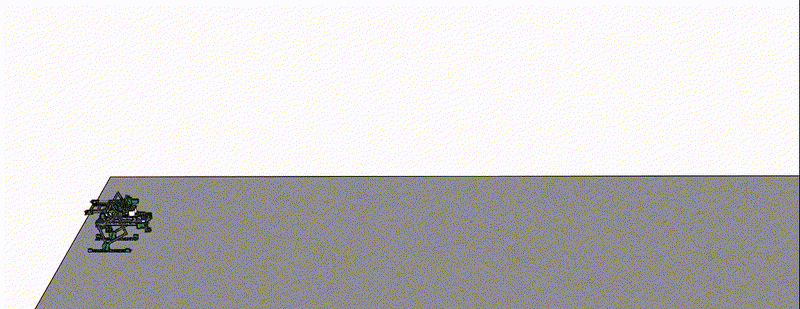
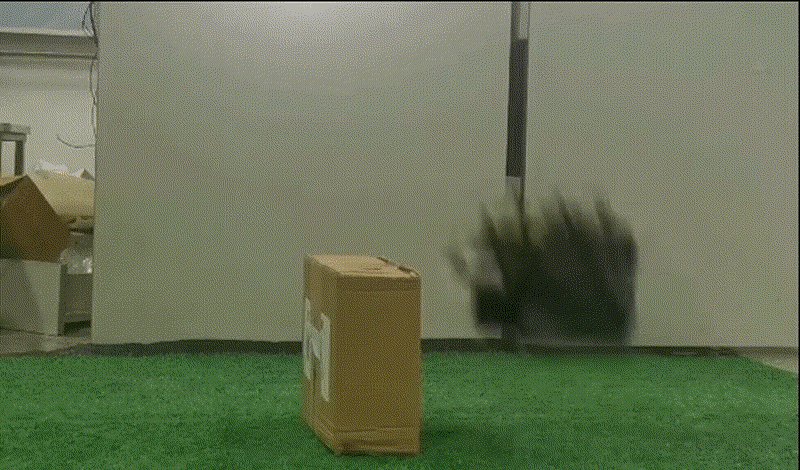
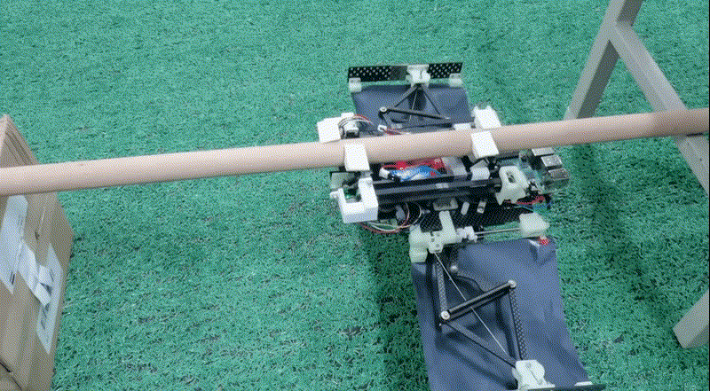

# jump-robot

🚀bio-inspired locust-like clawing/jumping robot 

-**stm32 for controlling (c)**

-**wechat app for interacting (wx)** 

-**rasberrypi for measuring height (py)**

## Project Showcase

We provide MP4 showcasing the core content and highlights of our project. U can download them.

-**sim in sw**

-**jump in real world**

-**headstand**

## Award Details

You can learn more about this award by following the link below.

http://11umic.hust.edu.cn/info/1109/1024.htm
